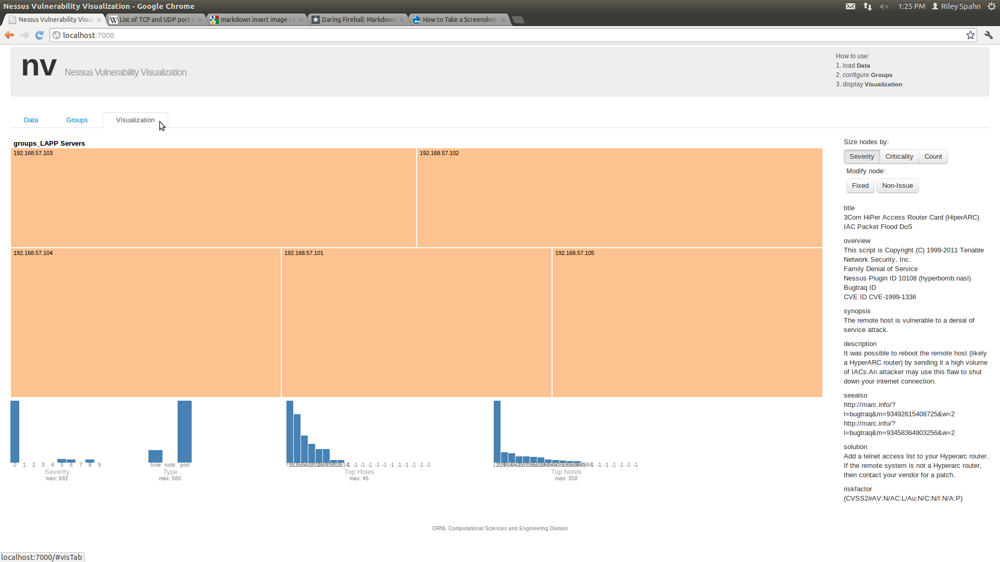

## Use Cases and Work Flow

We envision our system being useful for two types of use cases.  The first is
analyzing the current vulnerabilities associated with machines on a network.
This use case is to allow a system administrator to prioritize maintenance based
on the value of the machines and the criticality of the vulnerabilities found on
those machines using data from Nessus scans.  The second use case is visualizing 
the changes to the vulnerability states of machines on a network after a system
administrator performs maintenance.

### Dynamic Vulnerability State Network

The first use case for our system is to make it easier for administrators to
visualize that state of machines on a network before and after maintenance. 
The grouping functionality allows
the administrator to group together related machines by subnet, purpose of
functionality.  In this example virtual system machines are grouped into three
different categories.  One group is a set of twenty-two workstations split
between ten Fedora workstations and twelve Ubuntu workstations.  The second group is
a set of five servers that serve the Wordpress blogging software.  The last
grouping is a set of five Linux Apache PostgreSQL PHP (LAPP) servers.
Initially all of these groupings contain serious vulnerabilities.
The LAPP servers are running a poorly configured file transfer protocol (FTP) server
and both the LAPP and Wordpress servers both have very simple root passwords
which Nessus shows as a security hole.  The majority of the workstations are properly configured
save for two that contain multiple security holes.  Both of these workstations are
running outdated versions of the Ubuntu operating system and have
vulnerabilities such as an FTP server that allows a remote user to execute
arbitrary code, an incorrectly configured Windows file sharing software, weak secure shell
(SSH) keys and a Samba server that is vulnerable to buffer overflow attacks.

**Screen shot of group level (criticality) should go around here.**

While in the criticality visualization mode the administrators attention is
drawn to the very large LAPP server node.  The size is an indication of the
importance of the situation based on the number of security holes discovered,
the severity of the security holes discovered and the assigned criticality of
the machines in the group.  When the administrator zooms into the LAPP server
node of the treemap he sees that all five of the machines seem to be equally
at risk.  In this situation the LAPP servers all have the same
weak root password security hole.  The system administrator will also find that
the Wordpress servers suffer from the same weak password vulnerability as the
LAPP servers.

**Screenshot of zoomed in tree map can go here.**

When the administrator zooms back out to the
group view and switches the visualization to severity mode the workstations'
node grows, bringing it into greater prominence.  When the administrator
zooms into the workstation group he can see that two IP addresses have much
larger and darker node than any of the other workstations.  If he zooms into
one of these IP addresses he sees that the most severe of the vulnerabilities
are associated with ports 445 and 80.  After further examination the
administrator can see that the workstation is running a poorly configured Apache
Web Server and a Windows share that can be accessed through the network.

After further exploring his network the administrator patches the most critical
vulnerabilities in his system.  The Nessus Vulnerability Visualization system
provides functionality to compare two nbe files to show changes between two
vulnerability states such as before and after applying patches.  After patching
his system the administrator can explore and compare his patched system and
easily compare the differences.  The Nessus Visualization System shows corrected
vulnerabilities in green, the remaining vulnerabilities in orange and any new
vulnerabilities in pink.  The system administrator can easily see that the
major workstations vulnerabilities have been patched.  Zooming into the
workstation node the system administrator sees that while he patching the most
severe vulnerabilities he inadvertently opens a new vulnerability on the two
machines and does not solve the problems that lead to some of the notes left
open.

**Screenshot of diff treemap.**

In this use case we did not patch all security notes that Nessus mentions
because this would not be realistic for an actual system administrator.  Instead
the system administrator would handle the most important vulnerabilities and
system updates.  In this simulated use case we improved the weak root passwords
and removed the poorly configured FTP on the servers.  We focused on updating
and correcting the two most vulnerable workstations by making them up to date
with the other ten Ubuntu machines.

We simulated this use case using virtual machines (VM) networked through a host only
network. Using a host only network allowed us to use Nessus from the host
to scan the VMs.  We used one grouping of two different types of work station
and two groupings of similar servers. Both of the groups of servers were using Ubuntu 10.10 LTS.
Ten of the Ubuntu workstations were using Ubuntu 11.10 while the two workstations
with the massive number of vulnerabilities were using Ubuntu 8.04 (CHECK) with
purposely unpatched and misconfigured software.
The Fedora workstations were running Fedora 15.  We used the Metasploitable
virtual machine image to simulate the two vulnerable workstations before they
were upgraded to 11.10.

| Name              | Criticality | IP Addresses | Time period    |  Security Notes | Security Holes |
|:-----------------:|:-----------:|:------------:|:---------------|:---------------:|:--------------:|
| Workstations      | 2           | 192.168.56.x | Before Patches | 680             | 18             |
|                   |             |              | After Patches  | 507             | 0              |
| LAPP Servers      | 9           | 192.168.57.x | Before Patches | 205             | 5              |
|                   |             |              | After Patches  | 200             | 0              |
| Wordpress Servers | 5           | 192.168.58.x | Before Patches | 195             | 5              |
|                   |             |              | After Patches  | 195             | 0              |

### Static Vulnerability State Network

To test visualizing the static vulnerability state we use Nessus scan data from
the VAST Challenge 2011. This data is from a simulated network for the
fictitious All Freight Corporation.  The VAST challenge gives us a large network
dataset to test how the Nessus Vulnerability Visualization scales to a large
data set that contains many vulnerabilities spread across different machines and
groups.  This data set has more than one
hundred fifty unique IP addresses associated with various workstations in the
scan.  The Nessus scan shows that numerous
machines on the network have some sort of security hole such as incorrectly
configured telnet client, a font driver that allows privilege escalation and a
vulnerability in an outdated version of Microsoft Excel.  The All Freight
Corporation has other machines and servers but they were not included in the
Nessus scan data.

** Screenshot of over all **

We split the workstations into six groups with criticalities ranging from two to
nine.  The major security holes in the group are concentrated in group four with a
criticality of nine and in group five with a criticality of two.  When the
system administrator looks at the groups level on the tree map it is immediately
obvious where his attention is needed most.  Groups four and five dominate the
treemap in all three visualization modes.  When the system administrator zooms
into group four he sees that most of the vulnerabilities are locate on two IP
addresses.  When he selects IP address 192.168.2.172 he sees that nearly all of
the vulnerabilities are associated with port 445 and a Windows file sharing
program.  He can also explore the other dominate IP address 192.168.2.171 and
see that this machines vulnerabilities come from port 139 and NetBIOS.  The
Nessus Vulnerability Visualization system makes the most critical and most
severe vulnerabilities most prominent in the visualization This
exploration allows the system administrator to easily discover vulnerabilities
in his system and prioritize repair.  It also makes it easier to view large
networks because groups of IP addresses are aggregated in the tree and then the
IP addresses themselves can also be aggregated into treemap nodes.  

** Screen Shot of a zoomed in node **

**LOOK AT THIS**

TODO
| Name                    | IP Addresses      | Security Notes | Security Holes |
|:-----------------------:|:-----------------:|:--------------:|:--------------:|
| Low Value Workstations  | 192.168.2.0-172   | 556            | 919            |
| Mid Value Workstations  | 192.168.2.173-200 | 556            | 919            |
| High Value Workstations | 192.168.2.201-255 | 556            | 919            |

