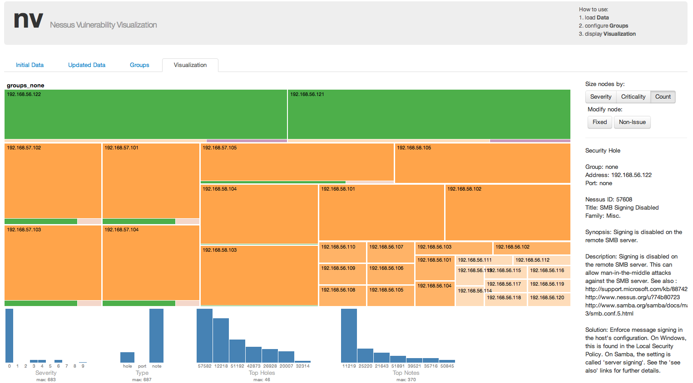
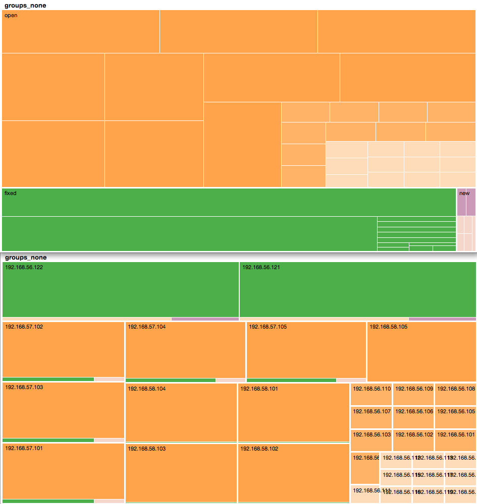
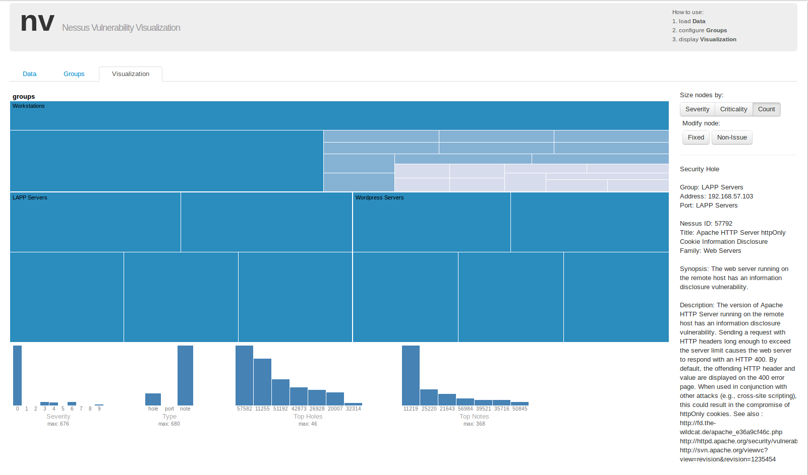
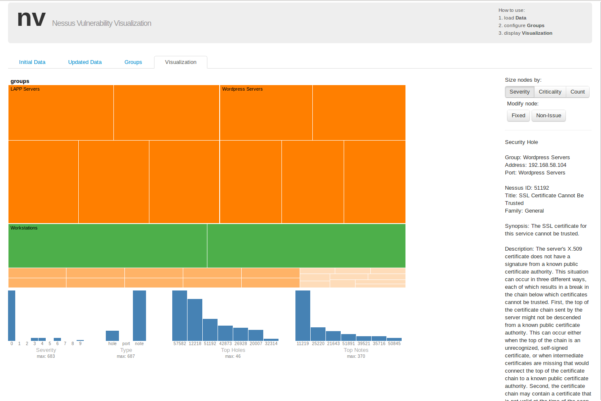
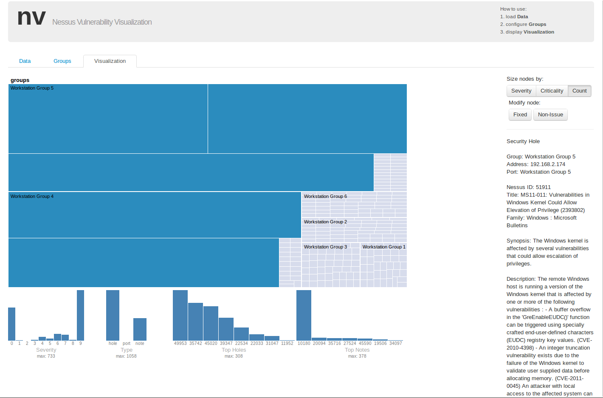
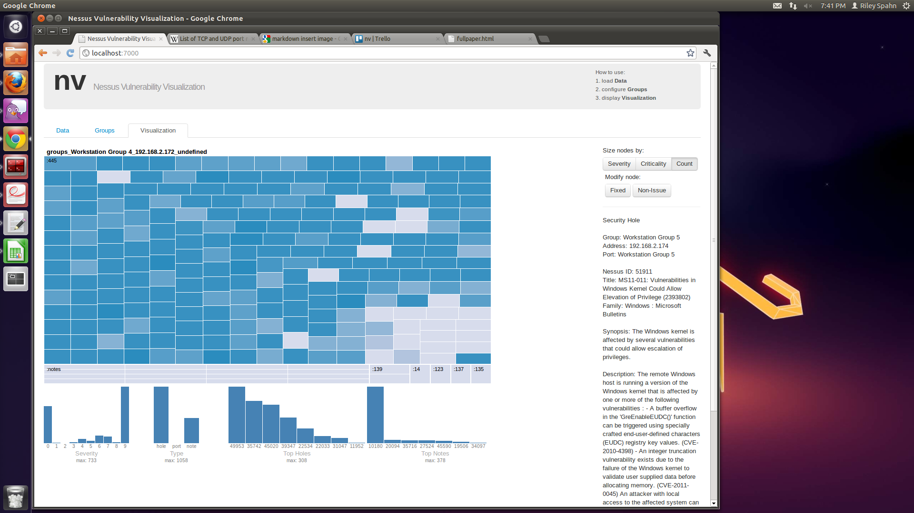

**Screen shot of overview here**

### Abstract
Network vulnerability is a critical component of network security. Yet vulnerability analysis has received relatively little attention from the security visualization community.  

### Introduction

Rather than monitoring a network to determine if an attack is occuring, analysts
Analysts who are aware of the

Increasingly, tools such as Nessus are used to assess networks.

Nv also allows analysts to specify specific groupings and criticality scores for machines in their network. This information is then used by to affect size and other visual features in the treemap, which helps ensure that the most important machines receive the most attention.

Specifically, our contributions to the field of security visualization are as follows:

- A visualization tool that supports security vulnerability awareness, analysis, and tracking
- A framework for building web-based visualizations that do not send sensitive data to servers

In the following section, we discuss related work in vulnerability visualization and analysis. Afterwards, we discuss the design of nv. We then present several case studies involving Nessus scans from multiple systems. We conclude with a brief discussion on web-based security visualization tools and on our future plans for nv.
### Related Works in Vulnerability Analysis

Currently, most computer vulnerability analysis is done using graph-based
techniques to model the state of the system. One such technique is known as
Topological Vulnerability Analysis (TVA). TVA uses the network state and attack
vectors between machines to create an attack graph that will model all possible attack paths in a
network. To generate these attack graphs TVA uses information from scanning
tools such as Nessus and Retina. These graphs generated by TVA tend to be 
large, so it introduces an aggregation and visual analysis element to make the
models easier to comprehend by an analyst. One aggregation method used by the TVA
visualization is to aggregate machines based on their ability to access other machines. A group of
machines will be aggregated if each node in the group has access to every other
node in that group.
These groupings are then aggregated into a single node in the visualization.
**Noel**

Researchers have also used model checking tools like NuSMV to manipulate graph
representations of a network where each node is a state of the network and each
transition represents an exploit.  This type of attack graph allows an analyst
to focus efforts on patching exploits (edges) that create the largest
disconnects in the graph. This type of analysis is convenient because we
already have graph algorithms that can efficiently perform such analysis.
**Aman**

Ou, Govindavjhala and Appel take a different approach to security analysis in
their MulVAL project.
They attempt to model the interactions between known vulnerabilities and
software bugs, configurations and permission policies.  In their approach an
analyst will specify the system and policies in a logic language that is a subset of the
Prolog logic programming language and vulnerabilities in the Open Vulnerability
Assessment Language. After the systems, policies, and vulnerabilities are defined
the MulVAL system uses a two-phase algorithm to simulate both attacks and policy
checking. The system generates all possible attacks based on the
vulnerabilities and then compares those with the defined policies to detect
violations.
**Ou**

### System Design

The goal of nv is to support the sysadmin's understanding of vulnerabilities in their network by combining the results of a Nessus scan in raw format and (optionally) a list of critial machines in their network into an interactive visualization. This visualization is designed to support common workflows in vulnerability discovery, analysis, and mitigation. Some of these are described in the Case Studies sections. This section covers the visualization and interaction design.

#### Data
Nessus data in detail

The Nessus scan results provide significant detail about the state of all machines on the specified network. (TODO talk about how the scan actually works?) This information includes the port the vulnerable service is running on, what service and what version is running, what other versions of this software share this vulnerability, and a general description of the vulnerability. These results also indicate whether this is an actual vulnerability or just a general security notice, and it also provides a severity score and several unique identifiers related to this vulnerability, which can be used to find additional information. The results also often give information about how this vulnerability can be patched or otherwise mitigated. Figure nnnnnnnnnnnnnnnnnnnnnnnnnnnnn (TODO) shows an example; this particular example is from the VAST Challenge 2011 data set.

results|192.168.2|192.168.2.175|cifs (445/tcp)|46844|Security Hole|Synopsis :\n\nThe remote Windows host contains a font driver that is affected by\na privilege escalation vulnerability.\n\nDescription :\n\nThe remote Windows host contains a version of the OpenType Compact\nFont Format (CFF) Font Driver that fails to properly validate certain\ndata passed from user mode to kernel mode.\n\nBy viewing content rendered in a specially crafted CFF font, a local\nattacker may be able to exploit this vulnerability to execute \narbitrary code in kernel mode and take complete control of the \naffected system.\n\nSolution :\n\nMicrosoft has released a set of patches for Windows 2000, XP, 2003,\nVista, 2008, 7, and 2008 R2 :\n\nhttp://www.microsoft.com/technet/security/Bulletin/MS10-037.mspx\n\nRisk factor :\n\nHigh / CVSS Base Score : 9.3\n(CVSS2#AV:N/AC:M/Au:N/C:C/I:C/A:C)\n\n\nPlugin output :\n- C:\\WINDOWS\\System32\\Atmfd.dll has not been patched\n    Remote version : 5.1.2.226\n    Should be : 5.1.2.228\n\n\n\nCVE : CVE-2010-0819\nBID : 40572\nOther references : OSVDB:65217,MSFT:MS10-037\n

#### Use Case
The primary goal of nv is to support sysadmins in identifying and analyzing vulnerabilities in their network, information which they may then use to better prioritize their (often) limited resources.
Specifically, the main questions nv seeks to answer are as follows:

- What vulnerabilities are most common across the network?
- What machines or groups of machines have the most severe vulnerabilities?
- Which critical machines (to the network) are vulnerable?

#### Visualization and Interaction
Nv consists of multiple coordinated views including a treemap, several histograms, and a detail-information area showing information on the selected Nessus item (id). Each of these views are designed to support a specific aspect of the vulnerability analysis workflow.

Our primary visualization is a zoomable treemap (TODO cite). We chose to use a treemap over other hierarchical visualization methods such as network/tree-layouts for several reasons. First, our goal with nv is to support the analysis of Nessus scans on large networks. While information on the network topology is useful for vulnerability analysis, it is important to note that in large dynamic networks, a complete network topology is often either unavailable or too large to be visualized directly. The space-filling aspects of treemaps make them more scalable in this regard. Another reason we used treemaps was for their ability to effectively make use of both size and color for encoding data attributes.

Since Nessus data is not stored in a hierarchical form by default, it can be visualized using many multi-dimensional visualization techniques, such as parallel coordinates or scatterplot matrices. However, because the scalability of the visualization was a primary concern, we opted to nest the data from individual vulnerabilities and ports up to IPs and groups of IPs. 

We also use data-accumulation and coloring methods to ensure that data is not obscured by the hierarchy. For instance, when comparing two Nessus scans, nodes are colored by the maximum count of issue states (fixed, open, or new issues) in their child nodes. A potential disadvantage of this approach is that a node could contain slightly more fixed issues (colored in green) than open issues (colored in orange), and yet will still be colored green to mislead the user to thinking that a node has mostly fixed issues. To alleviate this problem, we add the option to split the nodes by issue-state higher in the hierarchy. Both options are shown in figure (TODO make figure). 

**Screen shot of state_issue here**

The advantage to separating issue-states higher is that the analyst can explore only the fixed issues or only the open issues. However, the disadvantage of this approach is that the IPs are then separated since they can appear in any branch of the hierarchy (fixed, open, and new). To our knowledge, there exists no widely accepted visual technique that can effectively represent multiple attributes at every level in a treemap. However, we plan to explore other common approaches such as glyphs and combined color scales in future versions of nv. 

Since analysts can specify the criticality of both individual machines and groups of machines in nv, the treemap includes sizing by criticality as an option. The most critical machines therefore appear as larger nodes, while still being colored differently by severity. Other sizing options include sizing by severity (the default) and by issue counts. Having the node sizes and colors based off of severity can be useful, as the darkest colored and largest nodes appear at the top left in each level of the histogram.

The color scales in the treemap were created using ColorBrewer2 (TODO cite). While the primary color scales shown in the paper are designed to have semantic meanings (green for fixed, orange for open, and purple for new), we also include a colorblind-safe version shown in figure (TODO figure). 

**Screen shot of cb here**

Nv includes several histograms, including issue-type (note, hole, or open port), severity (CVSS score), top Nessus note ids, and top Nessus hole ids. These histograms serve dual purposes, as both overviews of the data and as filters by which sysadmins may guide their analysis. For instance, by brushing over the highest values in the severity histogram, the appropriate nodes in the treemap are highlighted. This works by examining each child of each element in the current level of the hierarchy in the treemap. Another use of the histograms is to easily highlight the most commonly occuring issues in the network. A possible drawback of this approach is that sometimes the least common issues can be the most damaging. However, this issue is mitigated by the fact that the treemap can be be sized and colored by severity, which makes the most damaging issues easy to find. The histograms also operate in conjunction (such as the boolean AND does), meaning that the sysadmin can specify to see only specific issues such as all issues containing type hole with severity of 5 of greater.

The Nessus information area is updated when the sysadmin arrives at the level at which Nessus issue-identification numbers are displayed. The area then updates with detailed information about the currently selected Nessus id, including a synopsis, detailed description, vulnerability family, and solution (when available). Based on this information, the sysadmin has the option to mark the vulnerability as either a fixed issue or as a non-issue, re-coloring the node in the treemap. This functionality is intended to serve as a way for analysts to avoid revisiting issues that have been addressed in the past. 

#### Implementation
One significant requirement for this project was to not unnecessarily disclose the Nessus scan results to any third parties; because this information would be very valuable to any attacker, the users of this tool would have an obvious concern to prevent its disclosure. To address this concern, the NV tool runs entirely in the browser client, without relying on any server-side functionality, and without loading any non-local resources. We were able to achieve this in a highly scalable implementation by combining several existing components, including the crossfilter data model library and the d3 library for data-driven DOM manipulation. We also developed a custom parser for the .nbe files, and related code to compare and merge these results.  We were also able to handle these tasks in the browser with good performance. For additional peace-of-mind to any users, the entire technology stack is open source, and the NV tool itself will also soon be open sourced.(TODO make less 'meh')

One difficulty caused by the requirement of not leaking scan results was how to look up additional details about the results. Nessus provides an interface to access significant additional information about any specific vulnerability ID, including useful details such as related CVE and Bugrtaq IDs, and information about how to patch or otherwise address each issue. However, using this directly could still give an adversary significant information; if they could observe any of this traffic, then they could still learn which vulnerabilities are present. To address this, we build a local cache of this information, which the client can access offline. (TODO presumably we won't be open-sourcing this part, heh. I guess that's obvious enough that we don't need to say it...)

The main treemap and the histograms were created using the d3 library (TODO cite), which is decigned for "apply[ing] data-driven transformations" to the Document Object Model (DOM).  D3 is fast, flexible, and supports large datasets, which were our main requirements. (TODO elaborate?  Should we maybe say that it's awesome but also a pain?  Not sure where to go with this ...)

The crossfilter library (TODO cite), designed for accessing "large multivariate datasets in the browser", was used to store and access our Nessus scan results and all related information about the machines and subnets on the network.  This handles the data entirely in memory, and handles storage and access in an efficient manner.  (TODO same issue as above.)

As with everything, jquery was used for massive convenience when manipulating elements and such. (TODO what else can we actually say about it?  TODO merge these 3 into one paragraph?)
## Use Cases and Work Flow

We envision our system being useful for two types of use cases. The first is to
analyze the current vulnerabilities associated with all machines on a network.
This use case is to allow a system administrator to prioritize maintenance based
on the value of the machines and the criticality of the vulnerabilities found on
those machines using data from Nessus scans. The second use case is visualizing 
the changes to the vulnerability states of machines on a network after a system
administrator performs maintenance.

### Dynamic Vulnerability State Network

The first use case for our system is to make it easier for administrators to
visualize the state of all machines on a network before and after maintenance. 
The grouping functionality allows
the administrator to group together related machines by subnet, purpose of
functionality. In this example, virtual system machines are grouped into three
different categories. One group is a set of twenty-two workstations split
between ten Fedora workstations and twelve Ubuntu workstations. The second group is
a set of five servers that serve the Wordpress blogging software.  The last
grouping is a set of five Linux Apache PostgreSQL PHP (LAPP) servers.
Initially all of these groupings contain serious vulnerabilities.
The LAPP servers are running a poorly configured file transfer protocol (FTP) server
and both the LAPP and Wordpress servers have simple root passwords
which Nessus shows as a security hole. The majority of the workstations are properly configured
save for two that contain multiple security holes. Both of these workstations are
running outdated versions of the Ubuntu operating system and have
vulnerabilities such as an FTP server that allows a remote user to execute
arbitrary code, an incorrectly configured Windows file sharing software, weak secure shell
(SSH) keys and a Samba server that is vulnerable to buffer overflow attacks.

**Screen shot of group level (criticality) should go around here.**

While in the criticality visualization mode the administrator's attention is
drawn to the large LAPP server node. The size is an indication of the
importance of the situation based on the number of security holes discovered,
the severity of the security holes discovered, and the assigned criticality of
the machines in the group. When the administrator zooms into the LAPP Server
node of the treemap they see that all five of the machines seem to be equally
at risk. To gain further insight, the administrator zooms into the node for a
specific machine where each node represents a port with an associated
vulnerability. At this specific port node the administrator can click on a
vulnerability ID and the tool will display information about the vulnerability
and potential solutions in the right-most panel of the tool. In this situation the LAPP servers all have the same
weak root password security hole. The system administrator will also find that
the Wordpress servers suffer from the same weak password vulnerability as the
LAPP servers.

**Screenshot of zoomed in tree map can go here.**

When the administrator zooms back out to the
group view and switches the visualization to severity mode, the workstation's
node grows bringing it into greater prominence. When the administrator
zooms into the workstation group they can see that two IP addresses have much
larger and darker nodes than any of the other workstations. If they zoom into
one of these IP addresses, they see that the most severe of the vulnerabilities
are associated with ports 445 and 80. The administrator can examine each port
node's child, seeing information about the specific vulnerabilities in the right-most
panel, discovering that the machine is running a poorly configured Apache
Web Server and that a Windows share that can be accessed through the network.

After further exploring their network, the administrator patches the most critical
vulnerabilities in the system. The Nessus Vulnerability Visualization system
provides functionality to compare two nbe files to show changes between two
vulnerability states, such as before and after applying patches. After patching
their system the administrator can rescan the network, then explore and see the
differences between the previous state and the newly patched system.
The Nessus Visualization System shows corrected
vulnerabilities in green, the remaining vulnerabilities in orange, and any new
vulnerabilities in pink. The system administrator can easily see that the
major workstations vulnerabilities have been patched. Zooming into the
workstation node the system administrator sees that while they were patching the most
severe vulnerabilities they inadvertently opened new vulnerabilities on the two
machines and did not address some of the vulnerabilities seen earlier.

**Screenshot of diff treemap.**

We simulated this use case using virtual machines (VM) communicating through a host-only
network. Using a host-only network allowed us to use Nessus from the host
to scan the VMs. We used one grouping of two different types of work station
and two groupings of similar servers. Both groups of servers were using Ubuntu 10.10 LTS.
Ten of the Ubuntu workstations were using Ubuntu 11.10 while the two workstations
with the massive number of vulnerabilities were using Ubuntu 8.04 with
purposely unpatched and misconfigured software.
The Fedora workstations were running Fedora 15.  We used the Metasploitable
virtual machine image to simulate the two vulnerable workstations before they
were upgraded to 11.10.

In this use case we did not patch all security notes that Nessus mentioned
because this would not be realistic for an actual system administrator. Instead,
the system administrator would only handle the most important vulnerabilities and
system updates. In this simulated use case we improved the weak root passwords
and corrected the poorly configured FTP server seen on the servers. We focused on updating
and correcting the two most vulnerable workstations by updating them to be the
same as the other ten Ubuntu workstations.

### Static Vulnerability State Network

To test visualizing a large static vulnerability state we use Nessus scan data from
the VAST Challenge 2011 (TODO cite). This data is from a simulated network for the
fictitious All Freight Corporation. The VAST Challenge gives us a large network
dataset to test how the Nessus Vulnerability Visualization scales to a large
data set that contains many vulnerabilities spread across a variety of machines and
groups. This data set has more than one
hundred-fifty unique IP addresses associated with various workstations in the
scan. The Nessus scan shows that numerous
machines on the network have some sort of security hole such as incorrectly
configured telnet client, a font driver that allows privilege escalation, and a
vulnerability in an outdated version of Microsoft Excel. The All Freight
Corporation has other machines and servers but they were not included in the
Nessus scan data.

** Screenshot of over all **

We split the workstations into six groups with criticalities ranging from two to
nine.  The major security holes in the group are concentrated in group four with a
criticality of nine and in group five with a criticality of two.  When the
system administrator looks at the groups level on the tree map it is immediately
obvious where their attention is needed most. Groups four and five dominate the
treemap in all three visualization modes. When the system administrator zooms
into group four, they see that most of the vulnerabilities are located on two IP
addresses. When they select IP address 192.168.2.172, they see that nearly all of
the vulnerabilities are associated with port 445 and a Windows file sharing
program. The system administrator can also explore the other dominate IP address 192.168.2.171 and
see that this machines vulnerabilities come from port 139 and NetBIOS. The
Nessus Vulnerability Visualization system makes the most critical and most
severe vulnerabilities most prominent in the visualization. This
exploration allows the system administrator to easily discover vulnerabilities
in the system and prioritize repair accordingly. It also makes it easier to view large
networks because the IP addresses are aggregated into nodes that can be expanded to view
the individual IP addresses contained in that group.

** Screen Shot of a zoomed in node **

### Conclusion

